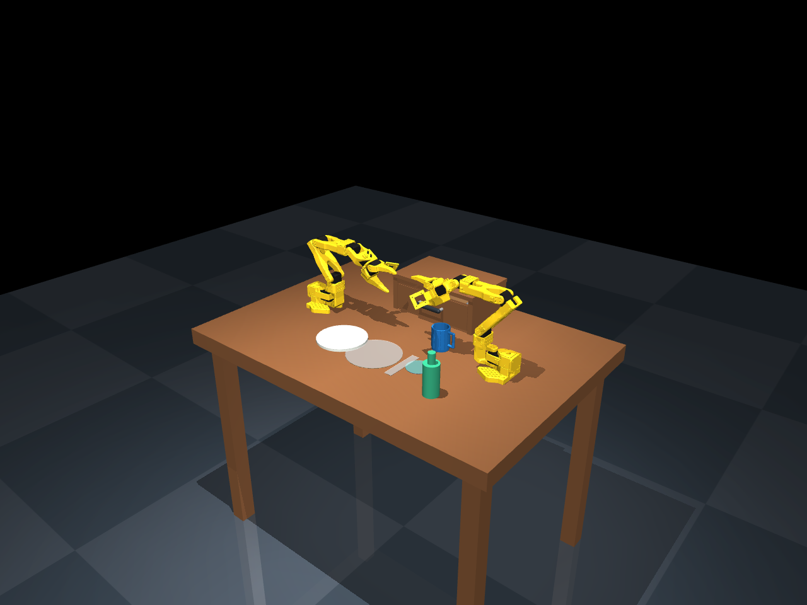

# Bimanual Table Setting

Simulation foundation for the Intel Physical AI Online Challenge: two SO-101 arms
sharing a MuJoCo dinner-table workspace.



## Quick start

Install [uv](https://docs.astral.sh/uv/getting-started/installation/), then:

```sh
uv sync --frozen
uv run python scripts/scene.py --check
```

Interactive viewer on macOS (MuJoCo requires its `mjpython` launcher):

```sh
uv run mjpython scripts/scene.py
```

Interactive viewer on Linux / Windows:

```sh
uv run python scripts/scene.py
```

Render a camera image:

```sh
uv run python scripts/scene.py --render output/overview.png
uv run python scripts/scene.py --camera overhead --render output/overhead.png
uv run python scripts/scene.py --camera left/wrist_cam --render output/left-wrist.png
```

For a headless Linux renderer, use `MUJOCO_GL=egl` with a working EGL driver,
or `MUJOCO_GL=osmesa` with OSMesa installed. Physics-only checks need no display.
The interactive viewer exposes MuJoCo's native control panel for actuator sliders
and camera selection. Escape unlocks the mouse; double-click selects bodies.

## Scene contents

- Two fixed-base SO-101 arms, namespaced `left/` and `right/`, with six position
  actuators each, including each gripper. Native robot dynamics and collision
  geometry are retained from Menagerie.
- A 1.04 × 0.72 m tabletop at z = 0.72 m, with arm bases at x = ±0.34 m.
- A tabletop cabinet with a passive, frictional drawer sliding toward -y over
  0.14 m. A physical handle and `drawer_grasp` site support future manipulation.
- Five free objects: plate, hollow blue cup with a handle, fork, spoon, and bottle.
  Utensils start inside the drawer. Object dimensions are scaled for this workspace.
- Cameras: `overview`, `overhead`, `front`, `left/wrist_cam`, `right/wrist_cam`.
- Non-colliding goal sites: `plate_goal`, `cup_goal`, `fork_goal`, `spoon_goal`,
  plus a `handoff` reference site.

The plate is a flat cylinder; the spoon bowl is a solid ellipsoid; the bottle is
closed and contains no fluid. The cup uses segmented collision walls. These are
initial manipulation assets, not high-fidelity kitchenware or fluid simulation.

`scenes/scene.xml` is the ready-to-load scene, using native MJCF model attachment
to instantiate the upstream robot twice. It can also be opened in MuJoCo tools.
The launcher initializes the arms to an open-gripper home pose. For programmatic use:

```python
from scripts.scene import load

model, data = load(seed=0)
# Controls are joint position targets in radians; always use named actuator lookup.
data.ctrl[model.actuator("left/gripper").id] = 0.7
```

Edit `scenes/dinner_table.xml` for environment changes, then regenerate the final
scene (the builder adds the cup walls and handle):

```sh
uv run python scripts/build_scene.py
```

## Validation and scope

`--check` simulates ten deterministic seeds for five simulated seconds each and
checks actuator/state dimensions, camera availability, finite state, MuJoCo warnings,
object retention on the table/in the drawer, and drawer travel bounds. Seeds vary
object x/y positions by up to 8 mm. A separate check applies 3 N directly to the
drawer joint to verify opening and closing; it does not claim robot manipulation.
Collision proxies are hidden in screenshots
and the viewer but remain active in physics.

This is a scene setup, **not a trained robot demonstration**. The ten-seed smoke
test does not establish challenge task success or robust manipulation. Reachability,
grasp execution, collision-aware planning, language grounding, broader domain
randomization, policy training, and OpenVINO/Intel benchmarking remain future work.

## Project layout

```text
assets/robots/so101/      Vendored robot XML, meshes, license, and upstream docs
scenes/dinner_table.xml  Editable environment source
scenes/scene.xml         Generated, ready-to-load MJCF
scripts/build_scene.py  Deterministic cup-geometry builder
scripts/scene.py        Reset, viewer, rendering, and physics smoke checks
docs/scene.png          Verified scene preview
THIRD_PARTY_NOTICES.md  Source revision and attribution
uv.lock                Pinned Python dependencies
```

The supplied challenge PDF is included in the repository for reference.

## Attribution

Robot assets are copied from Google DeepMind's MuJoCo Menagerie, based on The
Robot Studio SO-101. Their Apache-2.0 license is preserved alongside the assets.
See [THIRD_PARTY_NOTICES.md](THIRD_PARTY_NOTICES.md) for the exact source revision.
